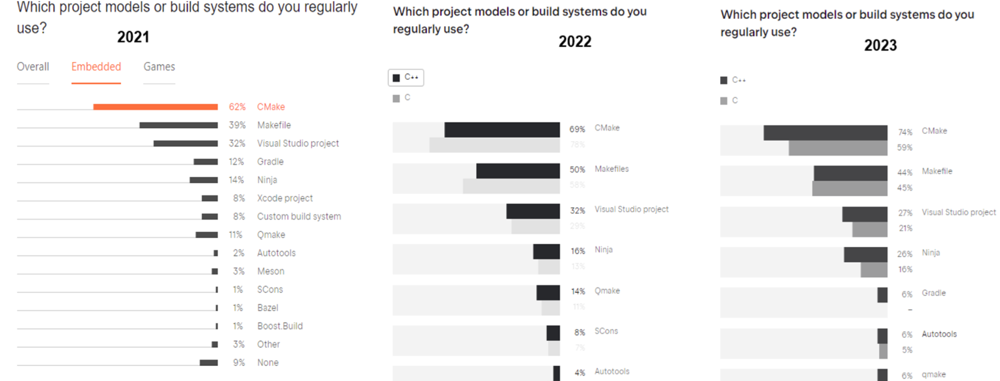
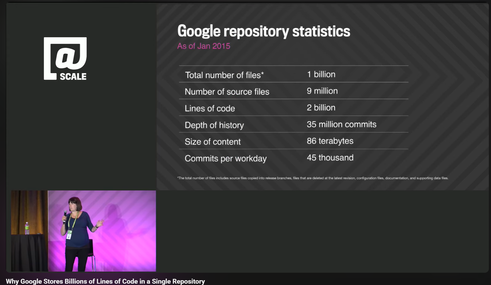

# Build Systems — Overview, Categories, and Industry Transitions

> Build systems are awesome, terrifying and unloved.

— Mokhov, Andrey, Neil Mitchell, and Simon Peyton Jones. ["Build systems à la carte."](https://www.microsoft.com/en-us/research/uploads/prod/2018/03/build-systems.pdf)

---

## Overview

Build automation is the process of automating:

- Compiling source code  
- Linking and generating binaries  
- Packaging artifacts  
- Running automated tests  

In the beginning, there was the make, and half a century later, it's still make.

CMake and Make are the dominating build tools in the Embedded/C++ community according to JetBrains surveys ([2021](https://www.jetbrains.com/lp/devecosystem-2021/), [2022](https://www.jetbrains.com/lp/devecosystem-2022/), [2023](https://www.jetbrains.com/lp/devecosystem-2023/)), the [Stack Overflow Developer Survey](https://survey.stackoverflow.co/), and [Sourcegraph](https://sourcegraph.com/).

---

## ⭐ Why Build Systems Are Awesome

### ⚙️ **Build-automation utilities**

Build systems are awesome because they **increase automation and reduce errors**.

Build automation utilities are tools designed to automate the code-building process. These tools can be categorized into two groups:

**Native build tools**, such as Make. For example, creating a makefile and using the Make command to build the code.
**Meta build systems** are tools that generate build files for other tools.

Tools used to *compile, link, and generate artifacts*:

- **Native tools:** [Make](https://www.gnu.org/software/make/), [Ninja](https://ninja-build.org/), [MSBuild](https://docs.microsoft.com/en-us/visualstudio/msbuild/)  
- **Meta/generator tools:** [CMake](https://cmake.org/), [Meson](https://mesonbuild.com/), [GN](https://gn.googlesource.com/gn/)  
- **Starlark systems:** [Bazel](https://bazel.build/), [Buck2](https://buck2.build/), [Pants](https://www.pantsbuild.org/)  

### **2. Build-automation servers**
**Build Automation Servers** primarily automate the process of building software applications.
Examples: Jenkins, GitHub Actions, GitLab CI, Buildkite, etc. *(not covered here)*

### **3. Build-automation platforms**
**Build-automation platforms** are toolsets designed for managing the entire lifecycle of software, from development and testing to deployment and automating a wide range of DevOps practices.

---

## 😱 Why Build Systems Are Terrifying

Build systems become terrifying due to:
- **Complexity**: Managing dependencies across multiple languages and platforms
- **Integration Issues**: Coordinating with various tools and environments  
- **Scalability**: Handling massive codebases efficiently
- **Performance**: Achieving fast, reliable builds at scale

### Understanding Monorepos

**Monorepo** (short for "monolithic repository") is a software development strategy where all the code for multiple projects is stored in a single repository. The concept of a monorepo has been around for quite some time, but its popularity emerged more recently in the 2010s when first Google, and then FB, Microsoft, and Twitter… started to use monorepo architecture.

### Measuring Scale: SLOC

Scale can be measured using **SLOC** – Source Line of Code.

Here is a [TechTalk](https://www.youtube.com/watch?v=W71BTkUbdqE&t=196s) where a Google Engineering Manager explains why it is not ridiculous to put 2 billion SLOC in one massive repository.

Because of monorepo architecture and build systems in that context, the companies started developing the build systems to handle their large monorepos:
Google with Bazel, Facebook with Buck, Twitter with Pants.

But after 10 years of development, Bazel has only captured **3%** of the market by JetBrains. In 2023, Facebook (now Meta) stopped using Buck and started to develop Buck2 because they said, they are now twice as smart. Twitter now, X stopped using their build system and switched to Bazel.

This analysis is based on talks from the Google Bazel Conference. The 3% market share figure (or 6% by Google metrics) may not be completely accurate, but it represents the best available statistics.

---

## 💔 Why Build Systems Are Unloved

Build systems are unloved because they are:

- **Too complex**: Often over-engineered for the problem at hand.
- **Hard to understand**: Steep learning curves and opaque configurations.
- **Difficult to debug**: Errors can be cryptic and hard to trace.
- **Not user-friendly**: Poor documentation and usability issues.

---

## 🏢 Monorepos & Starlark Build Systems

Large companies like Google, Meta, Twitter, Uber built systems for monorepos, requiring:

- Hermetic sandboxing  
- Strict dependency graphs  
- Deterministic builds  
- Remote caching & remote execution  

### Major Starlark systems

| Company | Internal | Public |
|--------|----------|--------|
| Google | Blaze | https://github.com/bazelbuild |
| Meta | Buck/Buck2 | https://github.com/facebook/buck2 |
| Twitter | Pants | https://github.com/pantsbuild |

📺 **Build System Talks:**
- [Bazel Conference Talks](https://www.youtube.com/channel/UCmCsF04SAy07w8OQqnJ1b2w)
- [Building at Scale with Buck2](https://www.youtube.com/watch?v=MzuEYRGm5tI)
- [Pants Build System Overview](https://www.youtube.com/watch?v=UqsTgD8F8VI)

---

## 🔁 Industry Migrations to Bazel / Buck2

### 📘 BMW Group Migration

| Year | Description | Scale | Notes |
|------|-------------|--------|-------|
| **2019** | CMake → Bazel | 23M SLOC | Multi-language monorepo |
| **2023** | Bazel ecosystem expansion | 70M SLOC | Internal tooling was required |

### Other notable migrations

| Company | From → To | Notes | Link |
|--------|------------|-------|------|
| Twitter | Pants → Bazel | 20M SLOC | https://github.com/pantsbuild |
| Uber | Make → Bazel | Large Go codebase | — |
| Dropbox | Internal → Groovy | Declared Bazel immature in 2019 | — |
| AirBnB | Buck → Bazel | iOS builds | — |
| Spotify | Xcode → Bazel | 2017–2023 | — |
| Tinder | Cocoapods → Bazel | iOS | https://github.com/Tinder/bazel-diff |
| Tencent | Xcode → Bazel | 8M+ SLOC | — |
| Stripe | Internal → Bazel | Multilanguage | — |
| Slack | Xcode → Bazel | 1M SLOC | — |
| Wix | Custom → Bazel | — | — |

---

## 🧱 Native Build Tools — Comparison

| Feature | Make | Bazel | Buck2 | Pants | Gradle | Ninja |
|--------|------|--------|--------|--------|--------|--------|
| Type | Native | Starlark | Starlark | Starlark | JVM | Native |
| Year | 1976 | 2015 | 2013/2023 | 2012 | 2008 | 2008 |
| Speed | Slow | Fast | Fast | Fast | Fast | **Very fast** |
| Declarative | No | Yes | Yes | Yes | Yes | No |
| Cross-platform | Yes | Yes | Yes | — | Yes | Yes |
| Written in | C | Java | Java/Rust | Python/Rust | Java | C++ |
| Cache | Timestamps | Content-based | Content-based | Content-based | Task cache | Timestamps |
| Distributed cache | No | **Yes** | TBD | — | — | No |
| Links | https://www.gnu.org/software/make | https://bazel.build | https://buck2.build | https://www.pantsbuild.org | https://gradle.org | https://ninja-build.org |

---

## 🛠 Meta Build Systems — Comparison

| Feature | CMake | GN | Meson | Waf |
|--------|--------|------|--------|------|
| Speed | Fast | **Very fast** | Fast | Medium |
| Used by | Vulkan, Folly | Chromium, Fuchsia | GStreamer, GTK | — |
| Declarative | Yes | Yes | Yes | Yes |
| Cross-platform | Yes | Yes | Yes | Yes |
| Written in | C++ | C++ | Python | Python |
| Documentation | Good | Good | Good | OK |
| Link | https://cmake.org | https://gn.googlesource.com/gn | https://mesonbuild.com | — |
