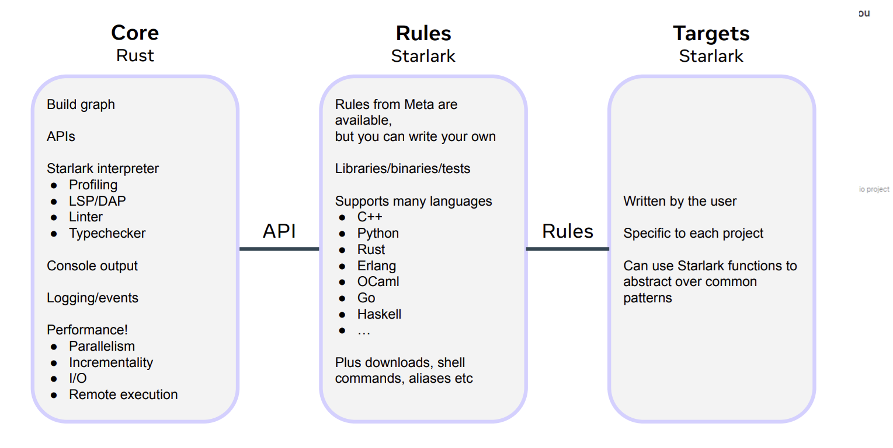

# Starlark build systems

In the world of enterprise software engineering, time is literally money. When you are operating at scale, your build system isn't just a background utility; it is the heartbeat of developer productivity. The two pillars of any high-performing engineering team are speed and reliability. If your build system fails these, your roadmap stalls.

## The Productivity Math: The Hidden Cost of Waiting
Build system inefficiency is easily measurable through lost engineering hours. If you want to calculate the ROI of a better system, look at these two formulas:

- **Iterative Build Cost:** (Number of Engineers) × (Average Builds per Day) × (Average Iterative Build Duration)
- **Cold Build Cost:** (Number of Engineers) × (Duration of a Full Build)

Every minute saved per developer, multiplied by thousands of engineers and daily iterations, translates into months of freed-up engineering time every single year.

## What is a Starlark Build System?
To solve the scaling issues of Monorepos, companies like Google and Meta moved away from traditional scripts to Starlark-based systems.

Starlark (formerly [Skylark](https://www.youtube.com/watch?v=Wv-ilbckSx4&t=365s)) is a high-level configuration language modeled after Python. It was designed to be:

- **Deterministic:** The same code + same inputs = the exact same binary. Every time.
- **Hermetic:** The build is isolated in a "sandbox." It doesn’t matter what is on your local machine; it only relies on declared dependencies.

In this architecture, engineers don't write "how-to" scripts; they define Targets and Dependencies. The system's Core then handles the graph logic to execute only what is necessary.

## The Evolution
The industry leaders have taken different paths to optimize the "Core":

- **Bazel (Google):** The industry standard, originally "Blaze." Its core is written in Java. While powerful, it carries the JVM overhead.
- **Buck2 (Meta):** Meta recently rewrote their build system from scratch in Rust. The engineering team famously jokes that they became ["twice as smart"](https://www.youtube.com/watch?v=EQfVu42KwDs&list=PLFTr8ChfQg9t9quFJNSoRwVHQhLFfTYnV&t=42s) (Buck2 / Buck-too) this time around, fixing the performance bottlenecks of the original Java-based Buck.
- **Pants (Twitter):** Originally developed by Twitter, Pants eventually saw many teams migrate toward Bazel as it became the more mature, community-backed standard.

## Industry Migrations to Bazel
While many use these systems for mobile OS platforms (iOS/Android), the most impressive implementations go much deeper.

| Organization | Scale | Technologies | Migration & Focus | Links |
| --- | --- | --- | --- | --- |
| BMW Group (2023) | 70M+ SLOC; ~2K engineers | Monorepo with C++, Python, Shell, Java, Go | From CMake to Bazel; built extensive custom ecosystem for scale | [Ecosystem overview](https://youtu.be/oui9v-ZKW-Y?t=14) • [CMake → Bazel talk](https://youtu.be/Gh4SJuYUoQI?t=77) |
| Twitter (X) | 20M SLOC; ~2K engineers | Scala, Python, Java, C++ | From Pants to Bazel | [Bazel migration talk](https://youtu.be/0l9u-FIaGrQ?t=127) |
| Uber | 70,000+ files | Go | From Make and go build to Bazel | [Go monorepo with Bazel](https://www.uber.com/en-SE/blog/go-monorepo-bazel/) |
| Dropbox (2019) | — | Android; custom Groovy tooling | Evaluated Bazel but stayed with custom Groovy-based system citing Android maturity gaps | [Android build system planning](https://dropbox.tech/mobile/modernizing-our-android-build-system-part-i-the-planning#:~:text=work%20on%20Buck.-,Build%20times,-Using%20the%20prototypes) |
| AirBnB | — | iOS build system | From Buck to Bazel | [Migration write-up](https://medium.com/airbnb-engineering/migrating-our-ios-build-system-from-buck-to-bazel-ddd6f3f25aa3) |
| Spotify | — | iOS app | From Xcode to Bazel; initial 2017 attempt succeeded in 2020–2023 after toolchain maturity | [Seamless build-system switch](https://engineering.atspotify.com/2023/10/switching-build-systems-seamlessly/) |
| Tinder | — | iOS app | From CocoaPods to Bazel for a hermetic toolchain; built bazel-diff | [Hermetic toolchain migration](https://medium.com/tinder/bazel-hermetic-toolchain-and-tooling-migration-c244dc0d3ae) • [bazel-diff](https://github.com/Tinder/bazel-diff) |
| Tencent | 8M+ SLOC | Decade-old iOS application | From Xcode to Bazel | [Case study video](https://www.youtube.com/watch?v=6HBeXl83yQw) |
| Stripe | — | Java, Scala, Python, Go | From custom build system to Bazel; heavy use of bazel-gazelle | [Engineering blog](https://stripe.com/blog/fast-secure-builds-choose-two) |
| Slack | 1M SLOC | Swift, Objective-C | From Xcode to Bazel to stabilize and modularize | [Scaling Slack's mobile codebases](https://slack.engineering/stabilize-modularize-modernize-scaling-slacks-mobile-codebases-2/) |
| Wix | — | — | From custom build system to Bazel | [Lessons learned](https://www.wix.engineering/post/bazelcon-2019-lessons-learned-from-migrating-our-build-system-to-bazel) |

## Deep Dive: BMW’s "Build World"
The BMW Group migration is a masterclass in build observability. Dealing with 70 million SLOC source lines of code, they had to build an entire ecosystem around Bazel:

- **AutoSheriff:** A tool using ElasticSearch to monitor "flaky" tests and automatically open tickets for fixes.
- **BuildBarn:** Used for regional cache management to solve cross-region latency.
- **Hermeticity:** It took them one full year just to ensure the build was 100% isolated and deterministic.

## Final Thoughts
Whether you choose Bazel (market share ~3-6%) or the cutting-edge Buck2, the goal is the same: eliminate the "it works on my machine" excuse and stop wasting engineering hours on compilation.